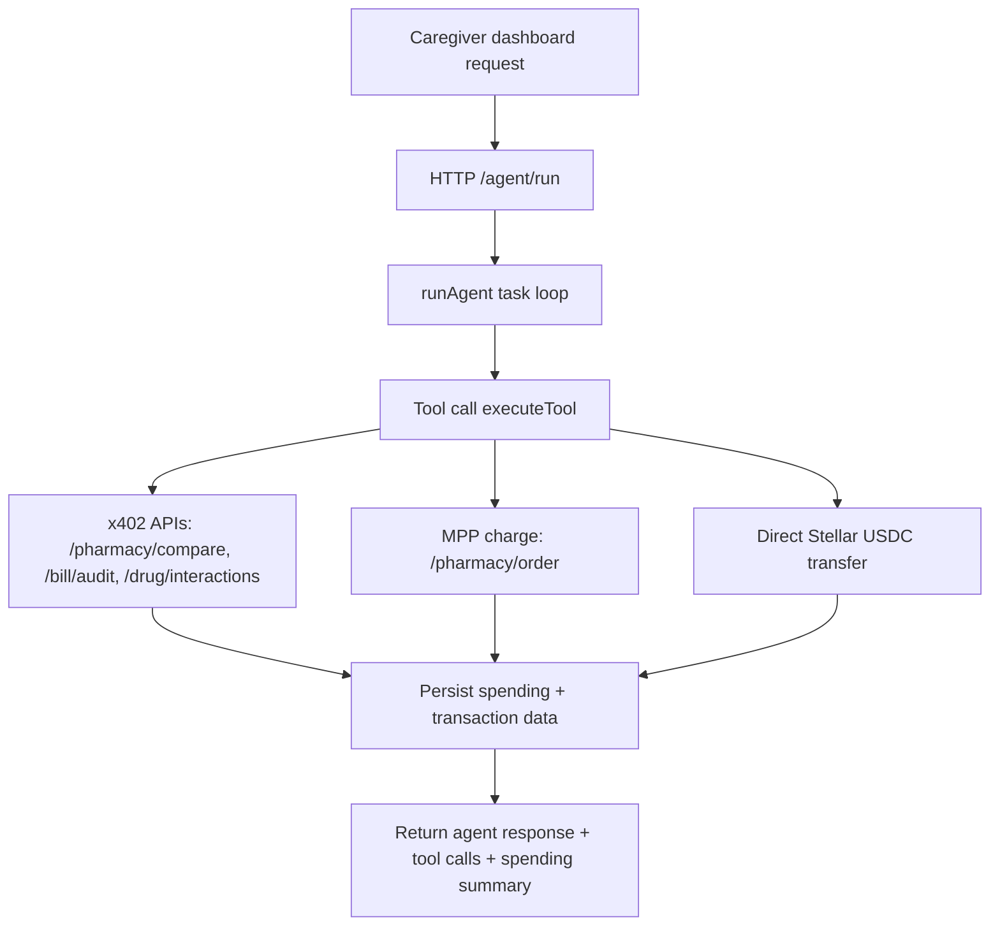

# CareGuard Architecture

This document explains the runtime flow, module boundaries, integrations, and core data shapes used by CareGuard.

## Runtime Flow



## Module Map

- `shared/`: cross-service types and middleware helpers.
- `agent/`: AI agent runtime (`runAgent` loop) and tool implementations.
- `services/`: standalone APIs for pharmacy pricing, bill audit, drug interactions, and pharmacy payment receiver.
- `dashboard/`: Next.js 16 caregiver UI with seven tabs and PDF export.
- `scripts/`: setup/bootstrap utilities (wallet creation, trustline/funding prep).

## Integration Points

- LLM provider: Groq-compatible OpenAI API (`https://api.groq.com/openai/v1`), default model `llama-3.3-70b-versatile`.
- OZ facilitator + x402 stack: `@x402/express`, `@x402/fetch`, `@x402/stellar` at `^2.11.0`.
- MPP stack: `@stellar/mpp@^0.4.0`, `mppx@^0.6.5`.
- Horizon: `https://horizon-testnet.stellar.org`.
- Stellar SDK: `@stellar/stellar-sdk@^14.6.1`.
- Circle USDC testnet faucet: <https://faucet.circle.com>.

## Data Shapes

`Transaction` (from `shared/types.ts`):

```ts
{
  id: string;
  timestamp: string;
  type: "medication" | "bill" | "service_fee";
  description: string;
  amount: number;
  recipient: string;
  stellarTxHash?: string;
  status: "pending" | "approved" | "completed" | "blocked" | "disputed";
  category: "medications" | "bills" | "service_fees";
}
```

`SpendingPolicy` (from `shared/types.ts`):

```ts
{
  dailyLimit: number;
  monthlyLimit: number;
  medicationMonthlyBudget: number;
  billMonthlyBudget: number;
  approvalThreshold: number;
}
```

`AuditLogEntry` (current dashboard activity-log shape; aligned with issue #72 direction):

```ts
{
  id: string;
  timestamp: number;
  message: string;
}
```

## Non-Goals

This architecture document does not cover:

- Full smart-contract enforcement design for Soroban policy guards.
- Mobile-client specific architecture.
- Production observability/alerting topology beyond current local-first logs.
- Infrastructure-as-code details for hosting each service.
